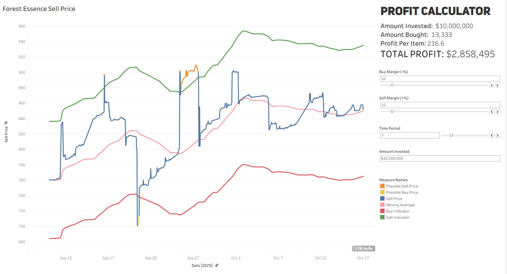

# Skyblock Market Analysis

## Project Overview
The goal of this project is to analyze item pricing trends on the Hypixel Skyblock Bazaar and provide actionable insights for trading. By collecting and visualizing market data, users can identify optimal buy and sell opportunities.

## Data Collection
Market data is gathered using a Jupyter Notebook that repeatedly queries the Coflnet API to capture hourly price information for selected items, data that is not publicly availabe.

## Data Cleaning and Preparation
Collected data is cleaned to remove empty or incomplete entries. Additional preprocessing includes:

- Populating datasets with mayor attributes for all recorded dates.
- Converting categorical data into a binary format for simplified analysis (e.g., each mayor has a column where 0 indicates inactive and 1 indicates active).

## Analysis and Visualization
A comprehensive Tableau dashboard was created with the following features:

- **Customizable Buy/Sell Indicators:** Users can adjust percentage margins applied to the moving average to define buy and sell signals.
- **Adjustable Moving Average Periods:** Allows analysis of trends over different timeframes.
- **Profit Simulation:** Visualizes potential buy/sell times and estimates profits based on selected parameters and indicates how many items would need to be sold.
- [**Dashboard Showcase**](https://public.tableau.com/views/FOREST_ESSENCE/Dashboard1?:language=en-US&:sid=&:redirect=auth&:display_count=n&:origin=viz_share_link)

## Conclusion
Early testing indicates that the dashboard can effectively identify opportunities to generate passive income from the Bazaar. The main limitation is the lack of an automated algorithm for selecting items, requiring users to manually identify those with the highest trading potential (this may be added in the future).
